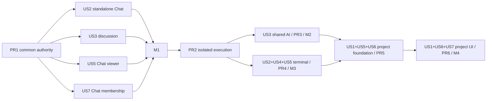

# Tasks: Collaboration and Session Sharing

**Input**: Design documents from `specs/121-collaboration-session-sharing/`
**Prerequisites**: `spec.md`, `delivery-plan.md`, `plan.md`, `research.md`, `data-model.md`, `contracts/`, `quickstart.md`
**Delivery constraint**: Keep the accepted six implementation PRs and four usable milestones. A task is not a new PR boundary. PR2 and PR5 stay disabled until PR3/M2 and PR6/M4 respectively are complete.

**Tests**: TDD is mandatory. In every PR, complete the listed red tests before the corresponding implementation task and preserve the failing-test evidence in the commit/PR notes.

**Task format**: `[ID] [P?] [Story] (PRn) action with exact path`. `[P]` means the task can proceed in parallel after its declared prerequisites because it changes different files.

**Active implementation**: PR1 uses the eight-layer Graphite review stack #1571–#1578 in the persistent manual worktree `/home/nima/matrix-os/.worktrees/collaboration-chat-discussion`, with top branch `codex/collaboration-chat-validation`, based on planning commit `d033116a7c4abe3683916a2d9fd5b563553abdcc` from PR #1558. These layers are one PR1 product milestone split only to satisfy the repository's review-size limits.

## Phase 1: Setup and Delivery Guardrails

**Purpose**: Establish the six-layer implementation workflow, confirm the current source seams, and repair the prerequisite toolchain before runtime claims.

- [x] T001 (PR1) Create the persistent PR1 manual worktree and conventional branch from the reviewed planning dependency, recording the branch/base in `specs/121-collaboration-session-sharing/tasks.md`
- [x] T002 (PR1) Revalidate the merged #1551 snapshot implementation and current canonical Chat/platform seams against `specs/121-collaboration-session-sharing/research.md`
- [x] T003 (PR1) Resolve the existing Zod/AnySchema and package-local install prerequisite failures in `packages/integrations-mcp/src/server.ts` and `pnpm-lock.yaml`, or record unchanged upstream failures without claiming downstream checks ran
- [x] T004 [P] (PR1) Add shared real-Postgres collaboration fixture helpers for distinct owner/editor/viewer/outsider identities in `tests/gateway/collaboration-test-support.ts`
- [x] T005 [P] (PR1) Add platform collaboration routing fixture helpers for provisioned and no-computer recipients in `tests/platform/collaboration-test-support.ts`
- [x] T006 [P] (PR1) Add reusable two-account collaboration journey fixtures in `tests/e2e/fixtures/collaboration.ts`

**Checkpoint**: PR1 has an isolated worktree, known baseline, and executable test fixtures; no capability is enabled.

---

## Phase 2: Foundational Collaboration Authority (PR1)

**Purpose**: Build the common, owner-local authority and actor-preserving ingress required by every story. This phase blocks all story behavior.

### Tests first

- [x] T007 [P] (PR1) Write red schema tests for scope, invitation, membership, lifecycle, user-state, event, actor-proof, policy, and connection-ticket contracts in `tests/contracts/collaboration.test.ts`
- [x] T008 [P] (PR1) Write red additive migration and existing-schema upgrade tests for owner collaboration tables and Chat attribution columns in `tests/gateway/collaboration-database.test.ts`
- [x] T009 [P] (PR1) Write red real-Postgres transaction tests for scope singleton creation, eight-seat capacity, invitation expiry, actor-scoped idempotency, and revoke/write serialization in `tests/gateway/collaboration-repository-postgres.test.ts`
- [x] T010 [P] (PR1) Write red authority matrix tests for owner/editor/viewer/pending/expired/revoked/outsider and inherited-resolution rejection in `tests/gateway/collaboration-authority.test.ts`
- [x] T011 [P] (PR1) Write red platform migration/repository tests for content-free directory, user index, rollout policy, and one-use ticket limits in `tests/platform/collaboration-repository.test.ts`
- [x] T012 [P] (PR1) Write red proof tests for actor preservation, body digest, method/path/query/audience binding, expiry, replay, key ID, header stripping, and constant-time verification in `tests/platform/collaboration-proof.test.ts`
- [x] T013 [P] (PR1) Write red exact-route proxy tests for no-computer recipients, route escape, owner-token separation, safe failures, API timeouts, and directory-not-authority behavior in `tests/platform/collaboration-proxy.test.ts`
- [x] T014 [P] (PR1) Write red realtime registry tests for exact query-ticket paths, async authorization, caps, stale eviction, per-send isolation, scoped replay, revoke drains, and shutdown in `tests/gateway/collaboration-events.test.ts`

### Implementation

- [x] T015 (PR1) Define strict Zod 4 collaboration HTTP/realtime schemas, bounds, roles, capability modes, and safe error codes in `packages/contracts/src/collaboration.ts`
- [x] T016 (PR1) Export collaboration contracts without changing snapshot schemas in `packages/contracts/src/index.ts`
- [x] T017 (PR1) Add versioned owner-Postgres collaboration tables, constraints, indexes, Chat actor/purpose columns, and migration bookkeeping in `packages/gateway/src/collaboration/database.ts`
- [x] T018 (PR1) Implement transactional scope, member, operation, audit, event, and directory-outbox persistence without owning the injected pool in `packages/gateway/src/collaboration/repository.ts`
- [x] T019 (PR1) Implement current-member resolution, role/action authorization, capacity/expiry, lifecycle, auth-epoch, idempotency, and owner-protection rules in `packages/gateway/src/collaboration/authority.ts`
- [x] T020 [P] (PR1) Implement bounded directory-outbox delivery with idempotent event IDs, capped retry/backoff, safe errors, and shutdown drain in `packages/gateway/src/collaboration/directory-outbox.ts`
- [x] T021 [P] (PR1) Add platform Kysely tables and additive migrations for directory/index/policy/tickets in `packages/platform/src/collaboration/database.ts`
- [x] T022 (PR1) Implement content-free platform directory/index and server-managed rollout policy repositories in `packages/platform/src/collaboration/repository.ts`
- [x] T023 (PR1) Implement short-lived signed actor proofs and signed policy snapshots using managed keys in `packages/platform/src/collaboration/proof.ts`
- [x] T024 (PR1) Implement gateway proof verification that constructs `AuthorizedCollaborationContext` without configured-owner fallback in `packages/gateway/src/collaboration/actor-proof.ts`
- [x] T025 (PR1) Implement exact collaboration HTTP proxying, caller-header stripping, bounded fetch timeouts, and safe response mapping in `packages/platform/src/collaboration/proxy.ts`
- [x] T026 (PR1) Implement hashed one-use connection tickets and exact collaboration WebSocket forwarding in `packages/platform/src/collaboration/websocket.ts`
- [x] T027 (PR1) Implement the capped scope-event registry, authorized replay, heartbeat/stale sweep, failed-sender eviction, revoke notification, and drain in `packages/gateway/src/collaboration/events.ts`
- [x] T028 (PR1) Register gateway dependencies, migrations, recovery, exact HTTP/WS routes, workers, and shutdown ordering in `packages/gateway/src/collaboration/wiring.ts`
- [x] T029 (PR1) Register platform database, policy, exact proxy/WS paths, internal directory/policy endpoints, and shutdown ownership in `packages/platform/src/collaboration/wiring.ts`

**Checkpoint**: A common authority and transport exist, but no story-specific resource adapter is advertised or enabled.

---

## Phase 3: User Story 2 - Share Only One Chat or Terminal (Priority: P1)

**Goal**: Grant access only to one selected item. PR1 completes the standalone Chat slice; PR4 later completes the terminal slice; PR5/PR6 reconcile item grants when a project becomes shared.

**Independent Test**: Share one Chat from a private project and verify canonical history/discussion access while its parent, siblings, private file destinations, and owner credentials remain inaccessible. After PR4, repeat with the same eligible terminal process.

### Tests first

- [x] T030 [P] [US2] (PR1) Write red Chat preflight/create tests for unique scope creation, active/private-work conversion fence, whole-history semantics, and no project grant in `tests/gateway/collaboration-chat-scope.test.ts`
- [x] T031 [P] [US2] (PR1) Write red boundary tests denying parent/sibling access and unsafe attachment destinations from a standalone Chat in `tests/gateway/collaboration-chat-scope.test.ts` and `tests/gateway/collaboration-chat-discussion.test.ts`
- [x] T032 [P] [US2] (PR1) Write red snapshot-token/live-proof substitution and independent snapshot/member revocation tests in `tests/gateway/chat-sharing-routes.test.ts` and `tests/gateway/collaboration-lifecycle.test.ts`
- [ ] T033 [P] [US2] (PR4) Write red standalone terminal scope, same-incarnation, and sibling/session-creation denial tests in `tests/gateway/collaboration-terminal-scope.test.ts`
- [ ] T034 [P] [US2] (PR6) Write red direct-item-to-project inheritance transition tests that never promote item-only participants in `tests/gateway/collaboration-membership-transition.test.ts`

### Implementation

- [x] T035 [US2] (PR1) Implement Chat scope preflight/create binding with active-work settlement and personal-dispatch fencing in `packages/gateway/src/collaboration/chat-scope.ts`
- [x] T036 [US2] (PR1) Implement canonical Chat-only read/history projection with inert unauthorized references in `packages/gateway/src/collaboration/chat-adapter.ts`
- [x] T037 [US2] (PR1) Register validated/body-limited standalone Chat scope and member routes in `packages/gateway/src/collaboration/routes.ts`
- [ ] T038 [US2] (PR4) Implement eligible terminal scope binding without replacement or sibling authority in `packages/gateway/src/collaboration/terminal-adapter.ts`
- [ ] T039 [US2] (PR6) Reconcile direct Chat/terminal grants into sole project inheritance at the publication point in `packages/gateway/src/collaboration/project-membership-transition.ts`

**Checkpoint**: At M1, a standalone Chat is independently shareable. Terminal and project conversion paths remain unavailable until their later PRs.

---

## Phase 4: User Story 3 - Work Together in the Same Chat (Priority: P1)

**Goal**: PR1 delivers canonical attributed human discussion with private drafts and all shared AI paths disabled. PR3 later adds the one-active-run, 32-pending shared AI queue and controls.

**Independent Test**: For M1, two members exchange attributed discussion and recover scoped history while every AI path creates zero work. For M2, concurrently submit AI requests and verify ordering, controls, recovery, and isolation.

### Tests first — M1 / PR1

- [x] T040 [P] [US3] (PR1) Write red canonical message attribution, purpose, historical-unknown-author, and discussion-no-run tests in `tests/gateway/collaboration-chat-discussion.test.ts`
- [x] T041 [P] [US3] (PR1) Write red actor-scoped message idempotency and commit-with-outbox tests in `tests/gateway/collaboration-chat-discussion-postgres.test.ts`
- [x] T042 [P] [US3] (PR1) Write red owner legacy bypass tests for start, queue, dispatch, steer, retry, approval, and reconnect paths in `tests/gateway/collaboration-m1-ai-gate.test.ts`
- [x] T043 [P] [US3] (PR1) Write red private draft/mode/account-switch and member-local read/pin/mute state tests in `tests/ui/collaboration-chat-state.test.tsx`
- [x] T044 [P] [US3] (PR1) Write red scoped event/reconnect tests proving no owner-wide cursor or duplicate discussion delivery in `tests/gateway/collaboration-chat-events.test.ts`

### Implementation — M1 / PR1

- [x] T045 [US3] (PR1) Extend canonical Chat record types and repository projections with immutable server-derived actor and message purpose in `packages/gateway/src/chat/records.ts`
- [x] T046 [US3] (PR1) Add transactional attributed discussion append with actor-scoped replay and collaboration event commit in `packages/gateway/src/collaboration/chat-adapter.ts`
- [x] T047 [US3] (PR1) Add the discussion-only adapter operation and safe paginated canonical history projection in `packages/gateway/src/collaboration/chat-adapter.ts`
- [x] T048 [US3] (PR1) Enforce the M1 execution fence in canonical owner routes, queue admission, dispatch, steering, retry, and approval seams in `packages/gateway/src/chat/service.ts`
- [x] T049 [US3] (PR1) Add separate scope-authorized invalidations and replay for shared Chats in `packages/gateway/src/collaboration/events.ts`
- [x] T050 [US3] (PR1) Implement shared-client draft keying and stable permission/presentation derivation in `packages/ui/src/collaboration/chat-state.ts`

### Tests first — M2 / PR3

- [ ] T051 [P] [US3] (PR3) Write red real-Postgres tests for idle/busy admission, immutable order, 32 pending, actor-scoped IDs, and one active run in `tests/gateway/collaboration-chat-queue.test.ts`
- [ ] T052 [P] [US3] (PR3) Write red reauthorization, competing approval, owner/editor cancel/retry, attempt lineage, and restart/unknown-outcome tests in `tests/gateway/collaboration-chat-controls.test.ts`

### Implementation — M2 / PR3

- [ ] T053 [US3] (PR3) Extend the canonical queue to shared idle/busy admission, 32 pending, immutable accepted sequence, actor/hash/epoch fields, and existing one-run guard in `packages/gateway/src/chat/queue-repository.ts`
- [ ] T054 [US3] (PR3) Implement durable approval/cancel/retry command claims, attribution, and distinct attempts in `packages/gateway/src/chat/collaboration-commands.ts`
- [ ] T055 [US3] (PR3) Reauthorize original actors before claim/dispatch and preserve explicit unauthorized/unavailable/interrupted outcomes in `packages/gateway/src/chat/orchestrator.ts`
- [ ] T056 [US3] (PR3) Wire PR2 scoped execution context and provenance into the canonical Chat adapter in `packages/gateway/src/collaboration/chat-execution-adapter.ts`
- [ ] T057 [US3] (PR3) Add shared AI request/control endpoints and versioned event projections in `packages/gateway/src/collaboration/routes.ts`
- [ ] T058 [US3] (PR3) Add discussion/AI mode, ordered queue, approvals, attributed controls, preserved draft-on-failure, and recovery UI in `packages/ui/src/collaboration/SharedChatControls.tsx`

**Checkpoint**: PR1/M1 is usable for discussion only. PR3/M2 adds AI only after PR2 proves isolation.

---

## Phase 5: User Story 5 - Review Shared Work Without Changing It (Priority: P1)

**Goal**: Enforce viewer read-only behavior at authority and resource boundaries, independently of hidden or disabled controls.

**Independent Test**: Use viewer and stale/outsider clients to read only the selected boundary and reject all direct and indirect mutations.

### Tests first

- [x] T059 [P] [US5] (PR1) Write red viewer/pending/revoked/outsider route-matrix tests for Chat discussion, state ownership, publishing, and direct legacy calls in `tests/gateway/collaboration-routes.test.ts`, `tests/gateway/collaboration-authority.test.ts`, and `tests/gateway/collaboration-m1-ai-gate.test.ts`
- [ ] T060 [P] [US5] (PR4) Write red viewer terminal input/paste/resize/takeover/stop/create denial tests in `tests/gateway/collaboration-terminal-authorization.test.ts`
- [ ] T061 [P] [US5] (PR5) Write red viewer indirect-write denial tests for files, Git, apps, agents, layout, search, stale links, and exports in `tests/gateway/collaboration-project-viewer.test.ts`

### Implementation

- [x] T062 [US5] (PR1) Enforce Chat viewer/pending/revoked/outsider permissions and owner-only snapshot publishing in `packages/gateway/src/collaboration/chat-adapter.ts`
- [x] T063 [US5] (PR1) Derive stable viewer controls, disabled explanations, and safe error presentation once for all clients in `packages/ui/src/collaboration/permissions.ts`
- [ ] T064 [US5] (PR4) Enforce observation-only terminal access in the shared terminal dispatcher in `packages/gateway/src/collaboration/terminal-dispatcher.ts`
- [ ] T065 [US5] (PR5) Enforce viewer-safe project resource adapters and unavailable unsafe apps in `packages/gateway/src/collaboration/project-adapters.ts`

**Checkpoint**: Every enabled resource has server-enforced viewer semantics; later resources remain unavailable until their adapter passes this phase.

---

## Phase 6: User Story 7 - Manage Membership and Lifecycle (Priority: P2)

**Goal**: Complete the owner-invite-accept-open-downgrade-revoke journey for Chat in PR1, then extend the same authority to later scopes and full lifecycle operations.

**Independent Test**: Race duplicate invite/accept/role/revoke operations, verify one outcome, immediate admission fencing, scoped connection closure, owner protection, and content-free audit.

### Tests first

- [x] T066 [P] [US7] (PR1) Write red invitation/member/lifecycle HTTP contract tests including body limits, Zod boundary validation, generic not-found, expected revisions, and safe errors in `tests/gateway/collaboration-routes.test.ts`
- [x] T067 [P] [US7] (PR1) Write red real-Postgres simultaneous invite/accept/downgrade/revoke tests and final-owner protection in `tests/gateway/collaboration-membership-races.test.ts`
- [x] T068 [P] [US7] (PR1) Write red audit retention/content-exclusion, scope export, soft-delete, and unrelated-data preservation tests in `tests/gateway/collaboration-lifecycle.test.ts`
- [ ] T069 [P] [US7] (PR6) Write red project archive/restore/transfer/delete/recovery integration tests in `tests/gateway/collaboration-project-lifecycle.test.ts`

### Implementation

- [x] T070 [US7] (PR1) Implement invitation preview/accept/revoke, role change, leave/revoke, own user state, lifecycle, operation, and export routes in `packages/gateway/src/collaboration/routes.ts`
- [x] T071 [US7] (PR1) Publish membership/audit/directory events atomically and invalidate scoped connections on downgrade/revoke through the collaboration repository, routes, and event registry
- [x] T072 [US7] (PR1) Implement platform inbox/shared discovery hydration for recipients without a provisioned computer in `packages/platform/src/collaboration/routes.ts`
- [ ] T073 [US7] (PR6) Complete project transfer/archive/delete/recovery orchestration without an ownerless or dual-authority state in `packages/gateway/src/collaboration/project-lifecycle.ts`

**Checkpoint**: PR1 provides complete Chat membership management and revocation; lifecycle extensions reuse the authority rather than creating per-resource grants.

---

## Phase 7: User Story 4 - Observe and Pass Terminal Control (Priority: P1)

**Goal**: PR2 proves/builds the dormant native isolation foundation; PR4 shares the exact eligible process with bounded replay and one fenced controller.

**Independent Test**: On a disposable VPS-native Linux host, attach owner/editor/viewer to the same session, transfer control, expire/disconnect/revoke, reject delayed actions, and preserve process/output truth.

### Tests and proof first — PR2

- [x] T074 [P] [US4] (PR2) Create a failing/positive native isolation probe for filesystem, environment, process, descriptors, sockets, DNS/egress, broker, and supervisor injection in `scripts/spikes/collaboration/scope-runtime-probe.ts`
- [x] T075 [P] [US4] (PR2) Record public-safe measured profile quotas, supported harness versions, failures, and eligibility in `scripts/spikes/collaboration/README.md`
- [x] T076 [P] [US4] (PR2) Write red supervisor protocol/profile validation, timeout, crash, restart, and shutdown tests in `tests/gateway/scope-runtime-client.test.ts`
- [x] T077 [P] [US4] (PR2) Write red scope-bound Chat execution provenance and private-resume rejection tests in `tests/gateway/collaboration-execution-context.test.ts`

### Implementation — PR2

- [x] T078 [US4] (PR2) Implement the fixed-profile non-root native supervisor service and least-privilege unit definitions in `distro/customer-vps/systemd/matrix-scope-runtime.service`
- [x] T079 [US4] (PR2) Implement strict opaque-handle supervisor IPC with no arbitrary host path/unit/env/command fields in `packages/scope-runtime/src/protocol.ts`
- [x] T080 [US4] (PR2) Implement gateway supervisor client, capability advertisement, timeouts, and lifecycle ownership in `packages/gateway/src/collaboration/scope-runtime-client.ts`
- [x] T081 [US4] (PR2) Implement bounded inference/egress broker actions that reuse existing access-source policy without exposing credentials in `packages/gateway/src/collaboration/scope-runtime-broker.ts`
- [x] T082 [US4] (PR2) Add release installation, compatibility, and rollback-safe disabled wiring for the supervisor in `scripts/build-host-bundle.sh`

### Tests first — PR4

- [ ] T083 [P] [US4] (PR4) Write red lease concurrency, owner takeover, editor wait, expiry, disconnect, epoch, and stale-incarnation tests in `tests/gateway/collaboration-terminal-control.test.ts`
- [ ] T084 [P] [US4] (PR4) Write red scoped replay/live ordering, caps, slow-client eviction, exit/restore, and shutdown tests in `tests/gateway/collaboration-terminal-events.test.ts`

### Implementation — PR4

- [ ] T085 [US4] (PR4) Extend stable terminal metadata with creator, scope, incarnation, execution generation, and shared-control mode in `packages/gateway/src/shell/registry.ts`
- [ ] T086 [US4] (PR4) Implement capped per-session controller coordination and epoch-fenced acquire/release/renew/takeover in `packages/gateway/src/collaboration/terminal-control.ts`
- [ ] T087 [US4] (PR4) Route validated input/paste/resize/stop through current authority, creator rules, incarnation, connection, and lease epoch checks in `packages/gateway/src/collaboration/terminal-dispatcher.ts`
- [ ] T088 [US4] (PR4) Deliver bounded scope-only replay/live output and terminal state frames in `packages/gateway/src/collaboration/terminal-events.ts`

**Checkpoint**: PR2 remains dormant; PR4/M3 enables one real supported terminal adapter after M2 rollout, never an unrestricted fallback.

---

## Phase 8: User Story 1 - Share an Entire Project (Priority: P1)

**Goal**: PR5 builds the dormant all-or-nothing inventory/migration/resource foundation; PR6 exposes one complete confirmation and integrated shared project.

**Independent Test**: Convert a mixed existing project, confirm every owned item and membership effect, prove one authority/new-child inheritance, and inject failure at every journal state with no partial collaborator access.

### Tests first — PR5

- [ ] T089 [P] [US1] (PR5) Write red complete inventory/fingerprint tests for owned versus external files, Chats, apps, layout, and terminal incarnations in `tests/gateway/collaboration-project-inventory.test.ts`
- [ ] T090 [P] [US1] (PR5) Write red traversal/symlink/moved-root/dirty-write/incompatible-resource preflight tests in `tests/gateway/collaboration-project-boundary.test.ts`
- [ ] T091 [P] [US1] (PR5) Write red journal crash/recovery, source-write/cutover race, inventory reconfirmation, and one-authority publication tests in `tests/gateway/collaboration-project-transition.test.ts`
- [ ] T092 [P] [US1] (PR5) Write red inherited existing/new file/Chat/app/layout/terminal creation tests in `tests/gateway/collaboration-project-inheritance.test.ts`

### Implementation — PR5

- [ ] T093 [US1] (PR5) Implement complete owner-derived project inventory, blockers, fingerprint, and expiring confirmation tokens in `packages/gateway/src/collaboration/project-inventory.ts`
- [ ] T094 [US1] (PR5) Implement durable prepared/staging/fenced/committing/active transition journal and recovery in `packages/gateway/src/collaboration/project-transition.ts`
- [ ] T095 [US1] (PR5) Fence every legacy project writer/run admission and publish one authority after final inventory/version checks in `packages/gateway/src/collaboration/project-fence.ts`
- [ ] T096 [US1] (PR5) Implement atomic inherited child bindings and future-content membership resolution in `packages/gateway/src/collaboration/project-inheritance.ts`

### Tests and implementation — PR6

- [ ] T097 [P] [US1] (PR6) Write red complete inventory/no-exclusions/reconfirmation/member-effects UI tests in `tests/ui/collaboration-project-sharing.test.tsx`
- [ ] T098 [P] [US1] (PR6) Write red mixed-project two-account all-role journey tests in `tests/e2e/collaboration-project.spec.ts`
- [ ] T099 [US1] (PR6) Add full inventory confirmation, blockers, no-exclusion copy, membership effects, progress, and recovery UI in `packages/ui/src/collaboration/ProjectSharingDialog.tsx`
- [ ] T100 [US1] (PR6) Wire project sharing and inherited-access display across project entrypoints in `shell/src/components/projects/ProjectSharing.tsx`

**Checkpoint**: PR6/M4 is the first point whole-project sharing may be enabled; empty or partial inventories do not pass.

---

## Phase 9: User Story 6 - Share Project Apps and Spatial Context (Priority: P2)

**Goal**: Keep project app/data/layout shared while viewport, focus, selection, read state, and comparable presentation remain per member.

**Independent Test**: Two members see the same app data and layout mutations while their view state remains independent and viewers cannot mutate indirectly.

### Tests first

- [ ] T101 [P] [US6] (PR5) Write red scoped app-bridge, credential isolation, unsafe-app unavailable, and shared app-data tests in `tests/gateway/collaboration-project-apps.test.ts`
- [ ] T102 [P] [US6] (PR5) Write red targeted layout revision and member-private viewport/focus/selection tests in `tests/gateway/collaboration-project-layout.test.ts`

### Implementation

- [ ] T103 [US6] (PR5) Implement role-aware project app/data actions through the scoped MatrixOS bridge without personal credentials in `packages/gateway/src/collaboration/project-app-adapter.ts`
- [ ] T104 [US6] (PR5) Implement targeted shared layout updates and separate member-private presentation state in `packages/gateway/src/collaboration/project-layout-adapter.ts`
- [ ] T105 [US6] (PR6) Expose shared app/layout capability and safe unavailable states through common project presentation derivation in `packages/ui/src/collaboration/project-state.ts`

**Checkpoint**: M4 preserves the accepted shared-layout model and personal presentation separation.

---

## Phase 10: Applicable Surface Integration, Validation, and Release Evidence

**Purpose**: Complete each PR's named-surface behavior, repository gates, screenshots, rollback evidence, and milestone documentation without moving later capabilities forward.

- [x] T106 [P] (PR1) Write red two-action Share chooser, snapshot regression, member management, discussion, viewer, draft, and safe navigation tests in `tests/ui/chat-collaboration-sharing.test.tsx`
- [x] T107 (PR1) Extend the common Share entrypoint with **Share snapshot** and **Invite collaborators** while preserving the existing dialog in `packages/ui/src/chat/ChatSharingButton.tsx`
- [x] T108 (PR1) Add invitation, acceptance, member list/roles/revoke, discussion composer, viewer, loading/empty/disabled/error/recovery views in `packages/ui/src/collaboration/ChatCollaboration.tsx`
- [x] T109 [P] (PR1) Wire the common collaboration UI and actor-scoped client into Web Canvas/Web Desktop/Web Mobile in `shell/src/components/chat/ChatSharing.tsx`
- [x] T110 [P] (PR1) Wire the same business contracts and UI behavior into Electron Desktop in `desktop/src/renderer/src/features/chat/ChatSharingButton.tsx`
- [x] T111 [P] (PR1) Wire invitation inbox/shared Chat/detail/discussion behavior into Native Mobile in `apps/mobile/lib/requests/collaboration.ts`
- [x] T112 [P] (PR1) Add authenticated inbox/accept/open/discuss commands with no owner fallback to the CLI in `packages/sync-client/src/cli/commands/collaboration.ts`
- [x] T113 (PR1) Run PR1 focused suites, the available pnpm-equivalent typechecks, `bun run check:patterns`, `bun run test`, React Doctor for `packages/ui`, `shell`, `desktop`, and `apps/mobile`, and record exact results and environment limitations in `specs/121-collaboration-session-sharing/quickstart.md`
- [ ] T114 (PR1) Capture current Web Canvas, Web Desktop, Electron Desktop, Web Mobile, and Native Mobile M1 screenshots/recordings and link public-safe evidence in `specs/121-collaboration-session-sharing/quickstart.md`
- [ ] T115 (PR1) Run the disposable VPS-native two-account M1 journey, rollback drill, no-computer recipient flow, and snapshot regressions; record exact versions/results in `specs/121-collaboration-session-sharing/quickstart.md`
- [ ] T116 [P] (PR3) Wire shared AI queue/controls across Web Canvas, Web Desktop, Electron Desktop, Web Mobile, Native Mobile, and CLI using `packages/ui/src/collaboration/SharedChatControls.tsx`
- [ ] T117 [P] (PR4) Wire terminal invitation/watch/control state across applicable Web/Electron/mobile/CLI clients using `packages/ui/src/collaboration/SharedTerminalControls.tsx`
- [ ] T118 [P] (PR6) Wire whole-project inventory/membership/lifecycle across applicable Web/Electron/mobile/CLI clients using `packages/ui/src/collaboration/ProjectSharingDialog.tsx`
- [ ] T119 (PR3) Validate M2 on the release artifact and record isolation/profile/queue/control/rollback evidence in `specs/121-collaboration-session-sharing/quickstart.md`
- [ ] T120 (PR4) Validate M3 on the release artifact and record same-process/control/revoke/rollback evidence in `specs/121-collaboration-session-sharing/quickstart.md`
- [ ] T121 (PR6) Validate M4 on the release artifact and record mixed-project/authority/recovery/rollback evidence in `specs/121-collaboration-session-sharing/quickstart.md`
- [ ] T122 [P] (D1) Publish M1 snapshot-versus-live collaboration documentation in the separate `FinnaAI/matrix-os-site` repository at `content/docs/collaboration/chat-sharing.mdx`
- [ ] T123 [P] (D2) Publish M2 shared AI queue and controls documentation in the separate `FinnaAI/matrix-os-site` repository at `content/docs/collaboration/shared-ai.mdx`
- [ ] T124 [P] (D3) Publish M3 eligible terminal sharing and control documentation in the separate `FinnaAI/matrix-os-site` repository at `content/docs/collaboration/terminal-sharing.mdx`
- [ ] T125 [P] (D4) Publish M4 whole-project sharing and lifecycle documentation in the separate `FinnaAI/matrix-os-site` repository at `content/docs/collaboration/project-sharing.mdx`

**Checkpoint**: Each milestone is independently usable and rollback-tested; documentation describes only the released milestone.

---

## Dependencies and Execution Order

### Phase dependencies

- **Phase 1** precedes all implementation.
- **Phase 2 / PR1 foundation** blocks every story-specific collaboration adapter.
- **US2 Chat + US3 M1 + US5 Chat + US7 Chat** combine into PR1/M1; all must pass before M1 enablement.
- **PR2** depends on PR1 and must prove isolation before implementing/advertising the adapter. It remains disabled.
- **US3 M2 / PR3** depends on PR2 and completes M2.
- **US4 terminal + US2 terminal + US5 terminal / PR4** depend on PR2; M2 rollout precedes M3 rollout.
- **US1/US5/US6 project foundation / PR5** depends on the completed PR3 and PR4 adapters and remains disabled.
- **US1/US6/US7 project UI/integration / PR6** depends on PR5 and completes M4.
- Documentation D1–D4 accompanies the corresponding milestone release without blocking implementation merge or internal enablement.

### User-story dependency graph

### Independent test criteria by user story

- **US1**: A mixed project transitions after one current full-inventory confirmation, has one writable authority, inherits new children, and survives every injected journal failure without partial access.
- **US2**: A selected Chat or eligible terminal is accessible without any parent/sibling/file/credential grant; project conversion never silently promotes item-only participants.
- **US3**: M1 discussion is attributed and starts zero AI work; M2 requests are actor-attributed, ordered once, one-active, reauthorized, recoverable, and draft-private.
- **US4**: All participants observe one terminal while one epoch-fenced controller acts; delayed/revoked input is rejected and process identity remains unchanged.
- **US5**: Viewers can read only the selected boundary and every direct/indirect mutation path fails server-side.
- **US6**: Project app/data/layout is common while viewport/focus/read/pin/mute state remains per actor.
- **US7**: Concurrent membership/lifecycle operations settle once, preserve a final owner, emit content-free audit, and close revoked access without touching unrelated data.

### Parallel opportunities

- Contract, owner-Postgres, platform-proof/proxy, and realtime red tests T007–T014 can be written in parallel before implementation.
- Within PR1, platform persistence/proof work T021–T026 can proceed beside gateway repository/authority work T017–T020 once T015–T016 land.
- Story-specific red tests marked `[P]` can proceed together before their implementation tasks.
- PR3 and PR4 implementation cannot both be published before PR2, but their red-test preparation can overlap after PR2 contracts stabilize.
- PR5 inventory, boundary, transition, inheritance, app, and layout red tests T089–T092/T101–T102 can be prepared in parallel after PR3/PR4 adapter contracts settle.
- Surface adapters T109–T112, T116–T118 share contracts/derivations but edit distinct projects and can be implemented in parallel within their owning PR.

---

## Graphite Stack Plan: Six Implementation PRs

The planning PR (#1558) remains separate. After its merge, initialize/sync Graphite on current `main`; create exactly these six implementation layers unless the actual diff exceeds the 3,000-addition/50-file hard limit or concrete reviewability evidence requires a split. An internal task, commit, contract, backend slice, or renderer is not automatically a PR.

1. **PR1 — `feat(collaboration): share Chat history and discussion`**: T001–T032, T035–T037, T040–T050, T059, T062–T063, T066–T072, T106–T115. Completes M1.
2. **PR2 — `feat(collaboration): add proven scope-isolated execution`**: T074–T082. Disabled execution foundation.
3. **PR3 — `feat(chat): add shared AI queue and controls`**: T051–T058, T116, T119. Completes M2.
4. **PR4 — `feat(terminal): share sessions with controlled input`**: T033, T038, T060, T064, T083–T088, T117, T120. Completes M3.
5. **PR5 — `feat(projects): prepare complete sharing transitions`**: T061, T065, T089–T096, T101–T104. Disabled project foundation.
6. **PR6 — `feat(collaboration): expose whole-project sharing`**: T034, T039, T069, T073, T097–T100, T105, T118, T121. Completes M4.

Every backend PR body includes Source of truth, Lock/transaction scope, Acceptable orphan states, Auth source of truth, and Deferred scope. Freeze each review range before requesting review; current-head Greptile 5/5 and all applicable checks are mandatory before merge. Do not flatten the stack.

---

## Implementation Strategy

### MVP first: PR1 / M1

1. Complete Phase 1 and the PR1 tasks in Phase 2.
2. Complete only the PR1 portions of US2, US3, US5, and US7 with tests first.
3. Complete T106–T115 across every applicable M1 surface.
4. Validate discussion-only behavior, no-computer invite, private state, all AI gates, scoped replay, revoke, snapshot independence, rollback, and current screenshots.
5. Commit working increments by contracts/tests, owner authority, platform ingress, Chat adapter, and UI, while keeping one PR.

### Incremental delivery

1. **PR1 → M1**: Share canonical Chat history and discuss together; AI remains denied everywhere.
2. **PR2**: Prove and build dormant isolation; M1 remains usable.
3. **PR3 → M2**: Enable shared AI queue/controls on the proven adapter; M1 remains independently available.
4. **PR4 → M3**: Share the same eligible terminal with fenced control; M1/M2 remain usable.
5. **PR5**: Build dormant complete-project authority transition using finished Chat/Terminal adapters.
6. **PR6 → M4**: Expose and validate whole-project sharing; no earlier partial-project capability exists.

## Notes

- `[P]` means different files and no dependency on an incomplete task; it does not authorize uncoordinated schema/interface divergence.
- TDD order is mandatory: red contract/race/journey tests precede runtime and UI implementation.
- Snapshot storage, tokens, preview/consent, expiry, public relay, and revocation remain separate from live collaboration.
- All new mutations use route-boundary Zod 4 validation and Hono `bodyLimit`; all external fetches use finite abort signals.
- Owner, editor, and viewer are the only roles. No task introduces excluded features or enables a later milestone early.
- Commit each working phase/logical group. Stop milestone enablement if real Postgres, actor-proof, isolation, recovery, surface, screenshot, or rollback evidence is missing.
